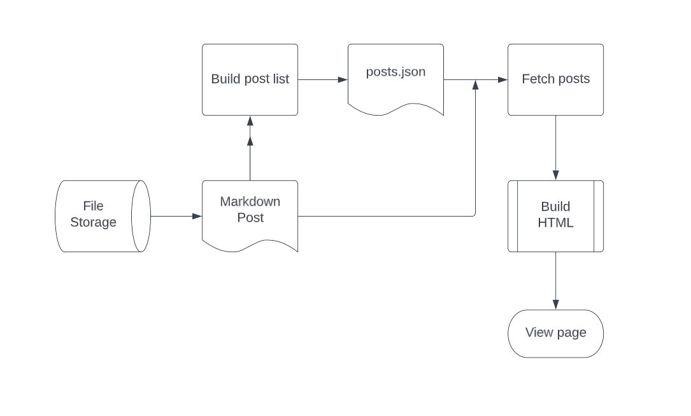
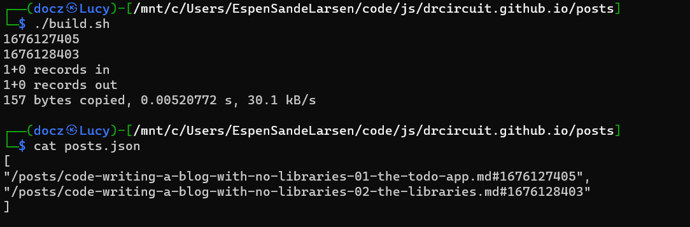

# Writing this blog without any libraries
## #2 - The libraries. 
_Yes, I know I said no libraries, hear me out..._

## Only two libs
I chose to use two more libs. Yes I know I am talking about libs, but I mean the huge libs and frameworks like Angular, React, Vue and so on. I don't count things like Bootstrap or any other common thing you load for a specific reason. I wouldn't criticize you for using the C standard library to handle file loading. Well, I might if we were writing a 16KB graphic demo, but that is the exception.

## Outline of the blog
So I knew I needed a way to create posts. I quickly thought that using markdown would be a cool way to achieve that. It isn't WYSIWYG necessarily, but it is easily written, and easily converted to HTML. And there are some nice libraries out there that do the parsing, lexing and rendering of markdown. I evaluated some different ones and landed on using MarkedJS. It is a pretty small library, it is extensible, and if I choose to not use it anymore, I can easily transit to another, or write my own. 

I also knew I wanted to show source code with syntax highlighting in multiple languages, so instead of writing a lexer and parser for all the languages I want to showcase, I opted to use HighlightJS. But I promise that's all the libs I am using! Well, I do use my own canvas library to render graphic effects - but that doesn't count! I wrote it - in vanilla JavaScript!

## Backend
I started writing a backend in .NET core but quickly stopped. Because as I was building that backend it dawned on me that I don't need a backend. Wait, what?! No backend?! Yes, no backend! Why would I want to create a backend, handle authentication and authorization, and secure everything and servers and hosting when all I want to do is essentially show text in a browser?

I asked myself the question: Does it need to be dynamic or can it be static? The answer was surprisingly the latter. I quickly drew up the super simple architecture of my blog:



So the idea is simple. Posts are stored on disk, listed in a JSON file, and the frontend loads that JSON file to display a list of posts. Those link to the actual markdown file, which is rendered by MarkedJS and shown to the user. All of this happens in the browser. Yeah, you may say that rendering Markdown is a backend task - but not in this case. We can easily defer the rendering to the browser, rendering a single page of markdown is easy for modern browsers. And that javascript engine has lots of free time because we are not using any SPA frameworks! More cycles for me!

The first hurdle is the posts.json file. I need to populate that somehow. Because there is no easy way for me to enable listing files to the front end without either a backend or at least control over a web server - neither of which I want. I could do it manually, but where's the fun in that? Let's write a quick shell script to do this:

```sh
#!/bin/bash
rm posts.json 2> /dev/null
echo "[" > posts.json
for file in $(ls *.md); do 
    ds=`date -r $file +%s`
    echo $ds
    name="  \"/posts/${file}#${ds}\",";
    
    echo $name >> posts.json
done
infile="posts.json"
outfile="posts2.json"
bs=$((`cat $infile | wc -c` - 2))
dd if=$infile of=$outfile bs=$bs count=1

echo "" >> posts2.json
echo "]" >> posts2.json

rm posts.json
mv posts2.json posts.json
```
This removes the current file, loops over all files in the directory *.md, adds that to the JSON file, and Bob's your uncle. I tag the date as a timestamp after the .md extension. This is because I want to show the date on the blog. I could add a property and so on, but I'm too lazy :)
I use dd to chop off the last bytes, that is the newline and the trailing comma.

Now all I need to do is run that, to get a list of posts into the json file:



Nice, exactly what I need! That little shell script just replaced the need for an entire backend, database and crud management! I also do not need any authentication scheme because it is all static! The most secure website is the website you do not have to secure...

I decide I want to not only have posts but also pages. 
Before we tackle the rendering, we know that we need a way to navigate this site, so we need a menu! Let's tackle that menu.

I decided I wanted the ability to create submenus with a drop-down function. A nice way to do that since we created this shell script build system is to use a directory structure. But I don't need infinite dimensions deep, so I decide I will only need one level of dropdowns. 

As we did for posts we can do the same for pages, but they can have a simpler build script, no dates needed, but we keep the sub-directory by using -R on the ls.

```sh
#!/bin/bash
rm pages.json 2> /dev/null
echo "[" > pages.json
for file in $(ls -R ./**/*.md); do 
    name="  \"/pages/${file}\",";
    echo $name
    echo $name >> pages.json
done
infile="pages.json"
outfile="pages2.json"
bs=$((`cat $infile | wc -c` - 2))
dd if=$infile of=$outfile bs=$bs count=1
echo "" >> pages2.json
echo "]" >> pages2.json
rm pages.json
mv pages2.json pages.json
sed -i 's/\/.\//\//g' pages.json
```

And shebang we got it! a pages.json, and a posts.json. This is all the backend we need. No database, no API, no NOSQL, nada nothing! Two JSON files are all we need.

Now that we have the menu, pages and posts backend ready, let's start building the front end.

But to keep these posts a bit shorter than the first one, let's continue in the next installment!

_Written by The WorkingClassHacker_