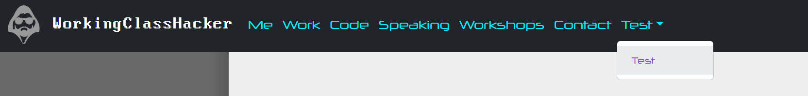

# Writing this blog without any libraries
## #3 - The menu.
_Ok, we got a JSON file, now what?!_

Just to recap, we have a JSON file that we built using our nice shell script. The file looks like this:
```json
[
"/pages/main/01-me.md",
"/pages/main/02-work.md",
"/pages/main/03-code.md",
"/pages/main/04-speaking.md",
"/pages/main/05-workshops.md",
"/pages/main/06-contact.md",
"/pages/test/test.md"
]
```

the folder acts like the menu option that the page is organized under, "main" will be the root level, while other folders will result in a drop-down menu, so "test.md" will be a choice in a drop-down menu named "Test". At least that is what I want to achieve. First, we need to create some boilerplate HTML, Next, we need to load the JSON file when the page loads.  I want this to be responsive - you know mobile-first and all that... So utilizing Bootstrap 5, I came up with this base structure:

```HTML
    <nav class="navbar navbar-expand-lg navbar-dark bg-dark fixed-top">
        <div class="container-fluid">
            <a class="navbar-brand" href="">
                
                WorkingClassHacker
            </a>
            <button class="navbar-toggler" type="button" data-bs-toggle="collapse"
                data-bs-target="#navbarSupportedContent" aria-controls="navbarSupportedContent" 
                aria-expanded="false" aria-label="Toggle navigation">
                <span class="navbar-toggler-icon"></span>
            </button>
            <div class="collapse navbar-collapse" id="navbarSupportedContent">
                <ul id="menu" class="navbar-nav me-auto mb-2 mb-lg-0">
                </ul>
            </div>
        </div>
    </nav>
    <main class="container-xxl">
        <div id="content" class="d-flex flex-fill justify-content-lg-center">
            <div id="page" class="page">
                <div id="blog">
                    <h1>Blog</h1>
                </div>
            </div>
        </div>
    </main>
    <footer>
        <div class="d-flex flex-wrap justify-content-lg-center">
            <p>Copyright &#169; 2023 by SunnyTownRoad Productions</p>
        </div>
    </footer>
```

So the nav element holds the menu, the main element holds the content - default is the blog post list, and finally a footer with the obligatory copyright line. Now we have the structure, we will parse the pages.json file and populate the unordered list with the id menu.

Step 1 do the "API call" to load the file:

```javascript
function loadMenu(cb) {
    fetch("/pages/pages.json")
        .then((d) => d.json())
        .then((p) => {
            createMenuElements(mapMenu(p));
            cb();
        })
        .catch((e) => cb(console.error(e)));
}
```
That is easy enough using the Fetch API, we call for the file, then we map the menu with the return data, and finally call back to continue the execution flow.
The createMenuElements first takes the output of mapMenu(). This sorts the menu into the nested structure for the sub-menus and maps all addresses for the static pages into a global hashmap called "addressMap"

```javascript
let addressMap = {};

function mapMenu(list) {
    let menu = {};
    list.forEach((i) => {
        let parts = i.split("/").filter(p => p !== ".");
        if (!menu[parts[2]]) {
            menu[parts[2]] = [];
        }
        let menuKey = parts[2];
        let friendlyName = parts[3].replace(".md", "").replace(/\d\d-/, "").ucFirst();
        let link = i.replace("/pages", "/#").replace(".md", "").replace("/.", "");
        addressMap[`/${friendlyName}`] = link.replace("/#", "");
        menu[menuKey].push({
            page: `/#/${friendlyName}`,
            menuEntry: menuKey,
            text: friendlyName 
        });
    });
    return menu;
}
```
The reason for that hashmap is I want the links on the page to not include the absolute path and .md extension. It isn't needed, but it is a quick and easy solution.
Notice the prototype function ".ucFirst()" that doesn't exist, I created it to be able to make the first letter of a word uppercase:

```javascript
String.prototype.ucFirst = function () {
    return this.charAt(0).toUpperCase() + this.slice(1);
}
```
pretty simple stuff... It is also nice that you can pollute - *cough* extend - namespaces like this in JavaScript.

The createMenuElements builds the HTML elements for the menu:

```javascript
function createDropDownMenuItem(e, entry) {
    let label = `${e}DropDown`;
    let li = createTag("li", ["nav-item", "dropdown"]);
    let a = createTag("a", ["nav-link", "dropdown-toggle"], e.ucFirst(), { href: "#", id: label, "role": "button", "data-bs-toggle": "dropdown", "aria-expanded": "false" });
    li.appendChild(a);
    let ul = createTag("ul", ["dropdown-menu"], "", { "aria-labelledby": label });
    entry.forEach(item => {
        let ili = createMenuItem(item, "dropdown-item");
        ul.appendChild(ili);
    });
    li.appendChild(ul);
    return li;
}

function createMenuItem(item, style = "nav-item") {
    let li = createTag("li", [style]);
    let a = createTag("a", ["nav-link"], item.text, { href: item.page });
    a.innerText = item.text;
    li.appendChild(a);
    return li;
}

function createMenuElements(pagelist) {
    let menu = document.getElementById("menu");
    menu.innerHTML = "";
    for (let e in pagelist) {
        let entry = pagelist[e];
        if (e === "main") {
            entry.forEach(item => {
                let li = createMenuItem(item);
                menu.appendChild(li);
            });
        }
        else {
            let li = createDropDownMenuItem(e, entry);
            menu.appendChild(li);
        }
    }
}
```

You can see the createTag function makes a comeback! And I also divide this functionality into helper functions for readability. The execution takes one of two paths, either it is part of the main menu, or it is part of a sub-menu. We create tags and end up with this HTML structure:

```HTML
<ul id="menu" class="navbar-nav me-auto mb-2 mb-lg-0">
    <li class="nav-item">
        <a class="nav-link" href="/#/Me">Me</a>
    </li>
    <li class="nav-item">
        <a class="nav-link" href="/#/Work">Work</a>
    </li>
    <li class="nav-item">
        <a class="nav-link" href="/#/Code">Code</a>
    </li>
    <li class="nav-item">
        <a class="nav-link" href="/#/Speaking">Speaking</a>
    </li>
    <li class="nav-item">
        <a class="nav-link" href="/#/Workshops">Workshops</a>
    </li>
    <li class="nav-item">
        <a class="nav-link" href="/#/Contact">Contact</a>
    </li>
    <li class="nav-item dropdown">
        <a class="nav-link dropdown-toggle" href="#" id="testDropDown" role="button" data-bs-toggle="dropdown" aria-expanded="false">Test</a>
        <ul class="dropdown-menu" aria-labelledby="testDropDown">
            <li class="dropdown-item">
                <a class="nav-link" href="/#/Test">Test</a>
            </li>
        </ul>
    </li>
</ul>
```

This is all we need for the menu. Next, we need to handle how we know what files we are rendering.



Let's start with hooking up the onload and pop state events to call the loading of the pages.json file.
Onload fires every time the page loads, and pop state fires every time the active history changes - that means every time we change the address bar, like page links!

```javascript
function load() {
    loadMenu(() => {
        loadBlog(() => {
            handlePage(parsePage(window.location.href));
        });
    });
}

window.addEventListener("load", (e) => {
    load();
});

window.addEventListener("popstate", (e) => {
    load();
});
```

We call the loadMenu, and I have created one for the blog posts.json also, but we will get back to that in the next post. Then we call handlePage and parsePage with the current address location. The parsePage function parses the anchor address, and finds the address map key, then returns the entry from the address map:

```javascript
function parsePage(address) {
    let parts = address.split("#");
    if (parts.length > 1) {
        return addressMap[parts[1]];
    }
    return "";
}
```

The interesting bit is in the handlePage function:

```javascript
function handlePage(page) {
    if (page !== "" && page) {
        renderPage(page);
        setBlogDisplay(false);
    } else {
        blog.innerHTML = "";
        setBlogDisplay(true);
    }
}
```

This figures out if we need to render a page, or we need to show the list of blog posts. This means we now have a functional menu system. We just need to figure out how to render pages.

That seems like a good cutoff and segway into the next post - stay tuned for more!

_Written by The WorkingClassHacker_