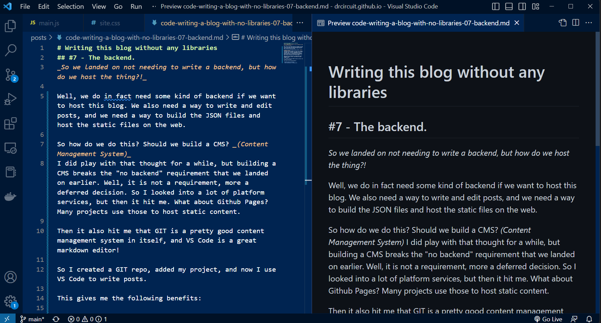

# Writing this blog without any libraries
## #7 - The backend. 
_So we landed on not needing to write a backend, but how do we host the thing?!_

Well, we do in fact need some kind of backend if we want to host this blog. We also need a way to write and edit posts, and we need a way to build the JSON files and host the static files on the web. 

So how do we do this? Should we build a CMS? _(Content Management System)_
I did play with that thought for a while, but building a CMS breaks the "no backend" requirement that we landed on earlier. Well, it is not a requirement, more a deferred decision. So I looked into a lot of platform services, but then it hit me. What about Github Pages? Many projects use those to host static content. 

Then it also hit me that GIT is a pretty good content management system in itself, and VS Code is a great markdown editor! 

So I created a GIT repo, added my project, and now I use VS Code to write posts.

This gives me the following benefits:

- Version control of all posts
- Syntax highlighting of markdown posts
- Live preview of markdown
- Debugging feature
- Offline editing!
- Spellchecking, grammar checking++
- Deploy and release pipeline through Github actions
- Hosting, scalability and security through Github pages

So using this has too many benefits to warrant writing a complete CMS to handle publishing pages and posts. It is much easier to fashion a comprehensive tool stack using VS-Code as a platform.

So to offer my take on the age-old debated question to buy vs build:
I feel you should build what lies close to your core business. In the case of this blog, the core is writing and presenting blog posts, and one of the key parts of this blog is exploring how few dependencies you need. Building that makes sense given that scope. But when it comes to writing the posts, managing the posts or hosting the static web app, well that is easy to defer to a third party, you are also not suffering from lock-in because I can move this blog to a different VCS, hosting platform, and I can just as easily use Atom, Electron, eMacs, VIM or any other IDE or text editor to write posts. I am also platform-independent since GIT runs on all modern platforms. I can even roll my own VCS, build-environment and hosting at my house if I so desire.

It does feel nice to have such a nice toolbox with so little effort put in:

I can keep it like this, but I do want to connect it to my domain, why else would you want a domain on the web? So that leaves one little configuration in the DNS, and add the configuration to GitHub pages. I get a sweet SSL certificate for free from this platform, and Bob's your uncle!

So that concludes this series on how I built this site. 
To summarize:
I chose to rely on libraries to render markdown client-side and to do syntax highlighting of code segments. I chose libraries that were extensible so that I may extend their functionality. Should I for some reason need to change one of these 3rd party dependencies, it is only a small job in a certain portion of the source code, the main bulk of my blog code is still my own and easy to maintain by me.

So what is the next step? Maybe I need to package this up and work it into a framework? Or maybe I am done with this for now and I should move on to more interesting topics - Stay tuned!

Written by The WorkingClassHacker